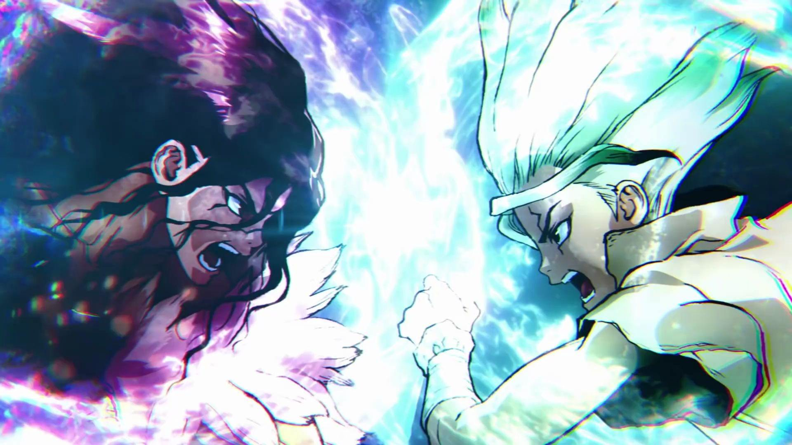

# 📑 Planning

We think Senku Inu to be more than just a meme token, we want it to promote the culture of Anime and Science. Senku's purpose is to promote the culture of anime. At the same time, we hope to have our own Swap, Dapp, NFT, Gamefi and our virtual mall to promote culture.&#x20;

Senku Inu will try to create an app to learn how to make the anime. Senku Inu will also try to invite famous animator and actors to join us.&#x20;

Community members can learn from the director by holding a certain amount of SENKU tokens. Members can tip professionals with our tokens.&#x20;

When you think you're ready, you can use our app to judge yourself. The app will rate you and offer different levels and NFTs based on the level you get. A small portion of the revenue will be used to supplement the dividend pool, from which you can earn rewards for holding our NFTs.&#x20;

Different levels of NFTs will receive different amounts of rewards. When our Senku Inu community is getting bigger and bigger, we can invent our own stone tool game, let more people who love science and culture join our magical world of science, have their own personality, and fight for glory.

